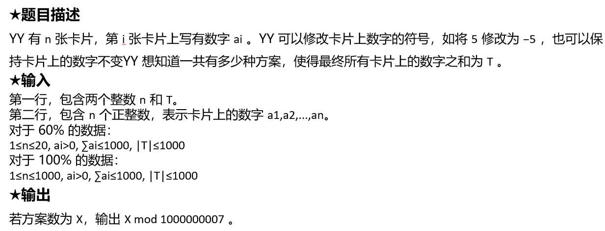
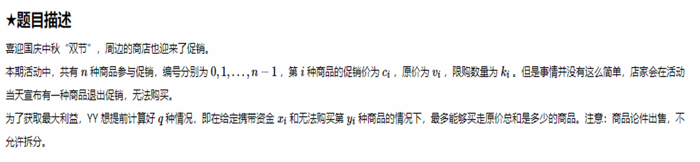
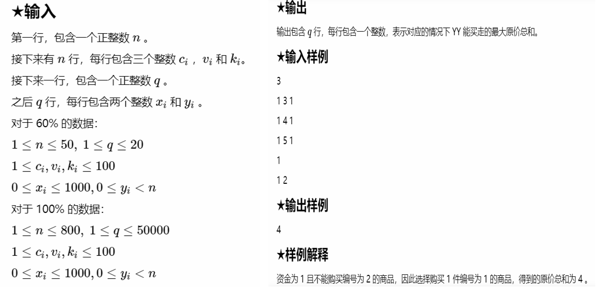
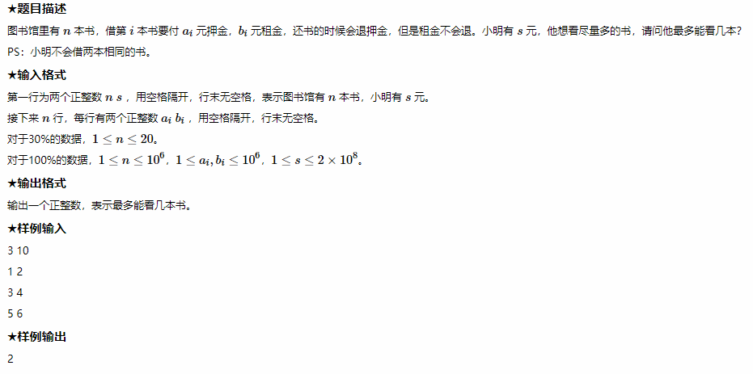
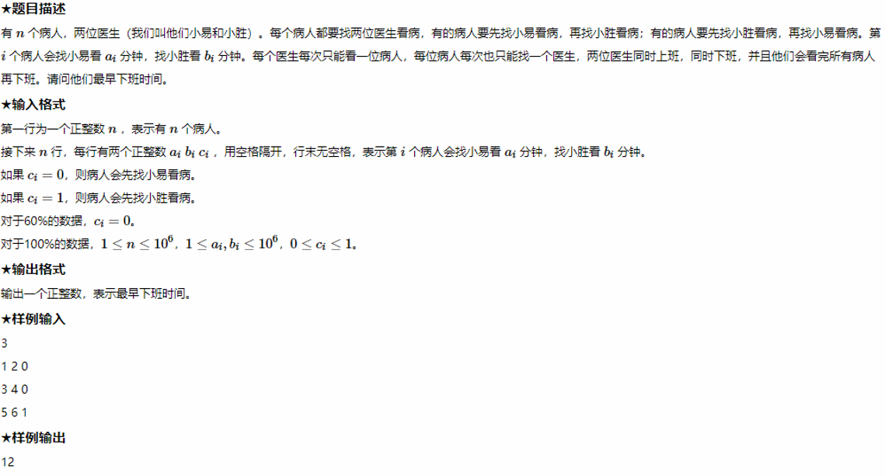
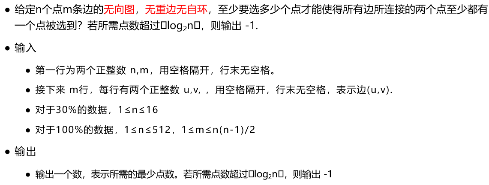
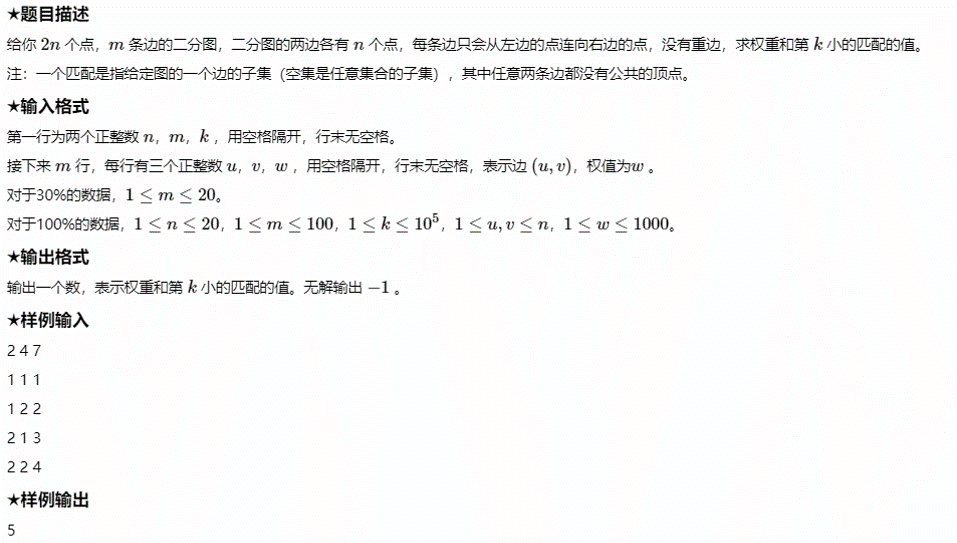

# 第一次作业

## YY and Matrix

### ★题目描述

YY 有一个大小为 $n * m$ 的矩阵，现在要对矩阵进行q次操作，操作分为如下三种：

0 x y：交换矩阵的x、y两行。

1 x y：交换矩阵的x、y两列。

2 x y：求当前矩阵第x行第y列的元素。

### ★输入

第一行三个正整数n、m、q，表示矩阵大小和操作次数。

接下来n行，每行m个空格隔开的整数，表示矩阵的元素。

接下来q行，每行三个数op、x、y，表示上述操作中的一种。

对于80%的数据，1 <= n、m、q <= 1000。

对于100%的数据，1 <= n、m <= 1000,1 <= q <= 1000000,矩阵元素大小在int范围内且非负。

### ★输出

对于操作2，输出一个整数，表示对应的元素。

### ★输入样例

```in
  2 2 6
  1 2
  3 4
  0 1 2
  1 1 2
  2 1 1
  2 1 2
  2 2 1
  2 2 2  
```

### ★输出样例

```out
4
3
2
1
```

### 代码

```c++
#include <iostream>

using namespace std;

int main() {
    ios::sync_with_stdio(false);
    cin.tie(0);
    int n, m, q, op, x, y;
    cin >> n >> m >> q;
    int matrix[n][m], row[n], col[m];
    for (int i = 0; i < n; i++) {
        row[i] = i;
        for (int j = 0; j < m; j++) {
            cin >> matrix[i][j];
        }
    }
    for (int i = 0; i < m; i++) {
        col[i] = i;
    }
    for (int i = 0; i < q; i++) {
        cin >> op >> x >> y;
        if (op == 0) {
            swap(row[x - 1], row[y - 1]);
        } else if (op == 1) {
            swap(col[x - 1], col[y - 1]);
        } else {
            printf("%d\n", matrix[row[x - 1]][col[y - 1]]);
        }
    }
    return 0;
}
```

## YY and Rectangle

### ★题目描述

有 $n$ 张卡片，标记为 $1, 2, ..., n$ 。标记为 $i$ 的卡片上写有正整数 $a_i$ 。

YY 和 ZZ 分别从这 $n$ 张卡片中选择一张卡片取出，假设 YY 和 ZZ 选择的卡片上的数字分别为 $a$ 和 $b$ ，如果 $a*b$ 的矩形的面积大于或等于给定的阈值 $p$ ，则称这次选择得到的矩形是“Perfect Rectangle”。

现在，YY想知道，对于不同的阈值 $p$ ，有多少种的选择使得她们得到的矩形是“Perfect Rectangle”。

**注意**：两人不会选择同一张卡片。

### ★输入

第一行，包含一个正整数 $n$。$(2 \leq n \leq 10^5)$

第二行，包含 $n$ 个正整数 $a_i$，表示卡片上的数字。（$1 \leq a_i \leq 3 *10^5$）

第三行，包含一个正整数 $m$ ，表示询问的次数。（$1 \leq m \leq 10^5$）

接下来有 $m$ 行，每行一个正整数 $p$ ，表示待询问的阈值。（$1 \leq p \leq 3 * 10^5$）

### ★输出

输出包含 $m$ 行，每行一个整数，表示对于对应的阈值，使得她们得到的矩形是“Perfect Rectangle”的选择个数。

### ★输入样例

```in
2
3 3
2
9
10
```

### ★输出样例

```out
2
0
```

### ★样例解释

有 2 张卡片，标记为 1 的卡片上写有正整数 3，标记为 2 的卡片上写有正整数 3

有 2 个询问：

- 对于询问 1，阈值为 9，因此她们可以有 2 种选择：（1, 2）和（2, 1）。

- 对于询问 2，阈值为 10，因此她们可以有 0 种选择。

### 代码

```c++
#include <iostream>
#include <cmath>

const int MAX = 3e5 + 5;

using namespace std;

int cnt[MAX];
int sum[MAX];

int main() {
    int n, m, temp;
    cin >> n;
    for (int i = 0; i < n; i++) {
        cin >> temp;
        // 统计每个数字i的出现次数
        cnt[temp]++;
    }
    for (int i = 3e5; i >= 1; i--) {
        // 计算所有牌中，有多少张牌上的数字 >= i
        sum[i] = cnt[i] + sum[i + 1];
    }
    cin >> m;
    double query;
    while (m--) {
        long long result = 0;
        cin >> query;
        int i;
        for (i = 1; i < sqrt(query); i++) {
            result += (long long) cnt[i] * sum[(int) ceil(query / i)];
        }
        result += (long long) sum[i] * (sum[i] - 1) / 2;
        cout << result * 2 << endl;
    }
    return 0;
}
```

## YY and Array

### ★题目描述

YY 最近很头疼，明明学习数组学得头都大了，Z 老师还喜欢出一些丧心病狂的题目。今日份的配方如下：

Z 老师给了 YY 四个长度均为 $n$ （下标为 $1, 2, ..., n$）的数组：$a, b, c, d$ ，以及对应的两种数组操作：

- 操作1：对于所有的 $i \in \{1, 2, ..., n\}$ ，同时将所有的 $a_i$ 改为 $a_i \bigoplus b_i$ ，$\bigoplus$ 表示异或操作。
- 操作2：对于所有的 $i \in \{1, 2, ..., n\}$ ，同时将所有的 $a_i$ 改为 $a_{d_i}+t$ 。注意，数组 $d$ 是 1 到 $n$ 的一个排列。

现在，Z 老师希望 YY 连续进行 $m$ 次操作，使得最后得到的 $\sum_{i=1}^na_ic_i$ 最大，求该最大值。

YY 光是理解题目就已经耗掉所有精力了，帮帮 YY 吧。

### ★输入

第一行包含三个正整数 $n, m, t$ ，分别表示数组长度、操作次数、操作2的参数。（$1 \leq n, m \leq 25, \ 0 \leq t \leq 100$）

接下来四行，每行 $n$ 个整数，分别表示数组 $a, b, c, d$ ，数组 $d$ 是 1 到 $n$ 的一个排列。（$1 \leq a_i, b_i \leq 10^4, \ -10^4 \leq c_i \leq 10^4$）

### ★输出

输出包含一个整数 $s$，表示能得到的 $\sum_{i=1}^na_ic_i$ 的最大值。

### ★输入样例

```in
2 1 0
1 1
2 2
1 -1
2 1
```

### ★输出样例

```out
0
```

### ★样例解释

操作次数为 1，因此只有两种可能：

- 进行一次操作1，$a: \{1, 1\} \Rightarrow \{3, 3\}$，最后得到 $\sum_{i=1}^2a_ic_i=0$
- 进行一次操作2，$a: \{1, 1\} \Rightarrow \{1, 1\}$，最后得到 $\sum_{i=1}^2a_ic_i=0$

因此，最大值为 0。

### ★提示

异或操作的性质：对给定的数A，用同样的运算因子B作两次异或运算后仍得到A本身。即：

$$A \bigoplus B \bigoplus B = A$$

### 代码

```c++
#include <iostream>

using namespace std;

int n, m, t;
int a[26] = {0}, b[26] = {0}, c[26] = {0}, d[26] = {0};
long long result = -0x3f3f3f3f;

void dfs(int f, int leftOperationCount) {
    // leftOperationCount是否是偶数
    if ((leftOperationCount & 1) == 0) {
        long long sum = 0;
        for (int i = 1; i <= n; i++) {
            sum += (long long) a[i] * c[i];
        }
        if (sum > result) {
            result = sum;
        }
    }
    if (leftOperationCount == 0) {
        return;
    }
    int temp[26];
    for (int i = 1; i <= n; i++) {
        temp[i] = a[i];
    }
    if (f == 0) {
        for (int i = 1; i <= n; i++) {
            a[i] ^= b[i];
        }
        dfs(1, leftOperationCount - 1);
    }
    for (int i = 1; i <= n; i++) {
        a[i] = temp[d[i]] + t;
    }
    dfs(0, leftOperationCount - 1);
}

int main() {
    cin >> n >> m >> t;
    for (int i = 1; i <= n; i++) {
        cin >> a[i];
    }
    for (int i = 1; i <= n; i++) {
        cin >> b[i];
    }
    for (int i = 1; i <= n; i++) {
        cin >> c[i];
    }
    for (int i = 1; i <= n; i++) {
        cin >> d[i];
    }
    dfs(0, m);
    cout << result << endl;
    return 0;
}
```

## YY and Square

### ★题目描述

YY 想找出所有的 $<n, m>$ 正整数对使得 $n$ 行 $m$ 列的表格中恰好包含 $t$ 个正方形。

### ★输入

输入一行，包含一个正整数 $t$。$(1 \leq t \leq 10^{18})$

### ★输出

第一行输出一个整数 $z$，表示 $<n, m>$ 对的个数。

接下来包含 $z$ 行，每行两个正整数 $n, m$，以空格分隔，表示 $n$ 行 $m$ 列的表格中恰好包含 $t$ 个正方形。

注意：输出 $<n, m>$ 对时，以 $n$ 递增的顺序输出，$n$ 相同时以 $m$ 递增的顺序输出。

### ★输入样例

```in
8
```

### ★输出样例

```out
4
1 8
2 3
3 2
8 1
```

### ★样例解释

 1行8列、2行3列、3行2列、8行1列的表格均恰好包含8个正方形

下图以2行3列为例：


### 代码

```c++
#include <iostream>
#include <vector>
#include <algorithm>

using namespace std;

int main() {
    unsigned long long t;
    cin >> t;
    vector<vector<unsigned long long> > ans;
    //i是行数，从1到n*(n+1)*(2n+1)/6 ，因为以n为边的正方形必定有t个正方形已满足条件
    for (unsigned long long i = 1; i * (i + 1) * (2 * i + 1) / 6 <= t; i++) {
        //平方和公式：n*(n+1)*(2n+1)/6
        unsigned long long remain = (t - i * (i + 1) * (2 * i + 1) / 6);
        //计算除去所求正方形个数减去以i为边长的正方形所提供的正方形个数
        //每增加一列，增加的正方形个数为1+2+3+...+i，即i*(i+1)/2
        unsigned long long increase = (i * (i + 1) / 2);
        //如果剩余的正方形数能整除增加一列所带来的新增正方形数目
        if (remain % increase == 0) {
            //那么列数就等于行数加上增加的列数
            unsigned long long j = remain / increase + i;
            ans.push_back(vector<unsigned long long>{i, j});
            if (i == j) {
                break;
            }
            ans.push_back(vector<unsigned long long>{j, i});
        }
    }
    sort(ans.begin(), ans.end());
    cout << ans.size() << endl;
    for (int i = 0; i < ans.size(); i++) {
        cout << ans[i][0] << ' ' << ans[i][1] << endl;
    }
    return 0;
}
```

## YY and Sequence

### ★题目描述

"12345678910111213..."，YY 回味着今天 Z 老师教授的知识点——这样的数字序列的第 $k$ 位数字是什么。

YY 突发奇想，如果把所有的这种数字序列排放在一起，那么序列的第 $k$ 位数字是什么。

总而言之，题目是这样的：

给定一个数字序列 "1121231234..."，序列是由"1", "12", "123", "1234" ... 拼接而成的，第 $i$ 个拼接的子序列由数字 1 到 $i$ 组成。现在有 $q$ 个询问，每个询问包含一个正整数 $k$，YY 想知道上述的数字序列的第 $k$ 位数字是什么。

### ★输入

第一行，包含一个正整数 $q$ 。（$1 \leq q \leq 500$）

接下来 $q$ 行，每行一个正整数 $k$ 。（$1 \leq k \leq 10^9$）

### ★输出

输出包含 $q$ 行，每行一个正整数 $x$，表示对应询问的第 $k$ 位数字。($0 \leq x \leq 9$)

### ★输入样例

```in
5
1
2
3
4
5
```

### ★输出样例

```out
1
1
2
1
2
```

### 代码

```c++
#include <iostream>

using namespace std;

int total[250005];
int sum[250005];

// 统计某个数字的位数
// e.g. 123456 -> 6
int numberLength(int num) {
    int count = 0;
    while (num) {
        count++;
        num /= 10;
    }
    return count;
}

/*
 * 1
 * 12
 * 123
 * 1234
 * total: 每一层的字符数
 * sum[n]: 前n层的总字符数
 */
int main() {
    int q, k;
    cin >> q;
    for (int i = 1; i <= 25000; i++) {
        total[i] = total[i - 1] + numberLength(i);
        sum[i] = sum[i - 1] + total[i];
    }
    string str;
    for (int i = 0; i < 23000; i++) {
        str += to_string(i);
    }
    while (q--) {
        cin >> k;
        int left = 1;
        int right = 25000;
        int index;  // k在第几层
        while (true) {
            int middle = (left + right) / 2;
            if (sum[middle] < k && sum[middle + 1] >= k) {
                index = middle;
                break;
            }
            if (sum[middle + 1] < k) {
                left = middle + 1;
            }
            if (sum[middle] >= k) {
                right = middle - 1;
            }
        }
        cout << str[k - sum[index]] << endl;
    }
    return 0;
}
```

# 第二次作业

## YY and Lucky Number

### ★题目描述

YY 的幸运数字是......，是什么数字我也不知道，但是已知这个数字的十进制表示（不含前导零）中只包含不超过两个不同的数字。

给定一个数 $n$ ，请计算出不超过 $n$ 的所有正整数中，有可能是 YY 的幸运数字的个数。

### ★输入

输入一行，包含一个正整数 $n$。

对于 60% 的数据：

$1 \leq n \leq 10^5$

对于 100% 的数据：

$1 \leq n \leq 10^9$

### ★输出

输出一个整数，表示不超过 $n$ 的所有正整数中，有可能是 YY 的幸运数字的个数。

### ★输入样例

```in
103
```

### ★输出样例

```out
101
```

### ★样例解释

 不超过103的所有正整数中，只有102、103不可能是 YY 的幸运数字。

### 代码

```c++
#include <iostream>

using namespace std;

long long n;
int ans;

// A -> 第一位数， B -> 第二位数, now -> 当前数值
void dfs(int A, int B, long long now) {
    // 如果当前数值 > n直接返回
    if (now > n) {
        return;
    }
    ans++;
    // 若前两位数字A、B不同，则分别搜索在当前数值后追加A和追加B的答案
    if (A != B) {
        dfs(A, B, now * 10 + A);
        dfs(A, B, now * 10 + B);
    } else {
        // 若前两位数字相同，则从0开始枚举后一位数字，继续搜索
        for (int i = 0; i <= 9; i++) {
            dfs(B, i, now * 10 + i);
        }
    }
}

int main() {
    cin >> n;
    if (n <= 9) {
        cout << n << endl;
        return 0;
    }
    ans = 9;
    // 枚举前两位数字
    for (int i = 1; i <= 9; i++) {
        for (int j = 0; j <= 9; j++) {
            dfs(i, j, i * 10 + j);
        }
    }
    cout << ans << endl;
    return 0;
}
```

## YY and Triangle

### ★题目描述

YY 有点无聊。

YY 在纸上随意乱画。

### ★输入

一个正整数 $n$ ，表示三角形的规模。$(1 <= n <= 10)$

### ★输出

画出对应的三角形，注意最后一个有效字符后直接回车，且不要输出多余的空格。

规模为 1 的三角形如样例所示。

规模为 $n$ 的三角形由三个规模为 $n-1$ 的三角形拼接而成。

### ★样例输入1

```
1
```

### ★样例输出1


### ★样例输入2

```in
2
```

### ★样例输出2

![avatar](data:img/jpg;base64,iVBORw0KGgoAAAANSUhEUgAAAFQAAAB5CAIAAAAoO5F+AAAFBUlEQVR4Ae2dv2sUQRTHN1oYCELAIliF+AdcYRFsTOUV4oU0psphFQQxWCRaWMR/QC6FXJlKLoVEsLizukJImcIiYCGIkEquC0ggFoI7czGzczs/N+/NbHZfqt2Z3Xnzed/3NvBedjN1enqa1PXnWl3BGTfB11V9Up6Ur6EHKOxrKDpHJuVJ+Rp6gMK+hqLTA4/CPlDYH/dWFrYPzsbW0pOZp/2TQKbVZgIqf9TvjrZWl6bHG5lvra/t9YYj9bbCjAaDPzvY78xtLDcusGab7c3D3vD4YiD8QSj4k2Fvp7nems8QTi+tbo26/aPMUODDQPDHg9295+3mrEzXWN6Y6+z/fwrIcyHOwsCn6X602Vo8T3fBlSZ+c6c3jPXYCwHP0j0RjzrBniQs8Ye7g0iJHwCepXsj+6jL0kdNfHx4lu5r8qMuS59ETHx0eJ7uuUddFj9e4iPDG9Jd8EdLfFx4Y7oL+liJjwpvS3eBHyfxp6hRKSSo1RFq2JfdkwRfdoWw9kfKY3m27OuS8mVXCGt/pDyWZ8u+LilfdoWw9kfKg3pWakoVWfnsYHvhXjdEOR9cebkpVQSelTaSzvCwyL1+9wDD55pSfrs5vzotbTS6ffxmBiy8oilViD5QTRMUXt2UKoIfpqYJCa9rShWhD1LThIN3qlJ7+CFATRMM3rFK7UGPn/hQ8O5Vand89MQHgrc3pdyZxZXYiQ8CD53uAh838SHg4dNd0KMmPgA8RroLeszEx2tX/Xg38/2jgMgctW62Br8HmQFx2Lr96cPdW+Ic9wgPHnffIKsDhD3IPqIsQvBR3F4Co6R8CUSIsgVSPorbS2CUlC+BCFG2QMpHcXsJjJLyJRAhyhYKKi815FDfEmOdu5Xe+G0E6C5eMXi5IZdWW9DeEpN6QNBdvCLwuYYcq7bgvCWWVomGm5m/1oft4hWAl8QY5ypWmVWOMGYLtKbnD69uyGGUWVmEzU6+nANZ0/OG1zXkQCXh8cSLwu372fcQ2ThglHnCGyr0kJIwSH1RGCzK/OCNFXpASVJ2Uw8IKsq84PViMKkSwLfEDBHGDAFFmQ+8SQy2JbhnsTHCmCGYKHOHt4jBtgQliS3CmCWIxHeGt4rBdgQjiT3CmCWAxHeFdxGDbenykjhFGDN0+cSndhXzYx1/XMO+kr4h+ErK6gBFyjs4qZKXkPKVlNUBipR3cFIlLyHlKymrAxQpr3FStlOkucQy7NzIktpflkWV04U6WQblWfli4hN2SruGwbTg4NTISssXmY8kGhbUTrG6lvf7aHr4tHwhdYq0dk0TrOBgbWSx8oX0kUTTitq5Ap0sLfzlxeDbdKg0AkQYN+Vf19LAMzFynSKt040TtkojK5DlP5JoXFIz6V3XUsPzamW+U6Qxahk2K8KrlYqPJFoWVU47hJl0nxLevVopraU7MSjiXK3UrT0xbgsz+XIVvFvpWF7HeKZVxLEeblxcnjSHmXyt4v/YQIvBDaoVAY4wbskQZhPoin/iAy8Gt6lSBDzCuCVtmOXYc8pjiMGt5hRBiTBuSh1mefZJeBwxuN0JRZAijJtShZmCXYbHE4ObziqCFmHcUi7MVOhJ4tSu+tb5/OyN8v4bT179ef9WPfX654OHc8op/eDo68s7v9QfjFi9nuz/Vd75+MujF4vKGcugE7xljSs7rfo9f2VhfDdO8L4eq8r1pHxVlPTlIOV9PVaV62ut/D9xq5q3e3vCWwAAAABJRU5ErkJggg==)

### 代码

```c++
#include <iostream>

using namespace std;

string triangle[1024] = {" /\\", "/__\\"};

void draw(int n) {
    // step = 2^(n-1)
    int step = 1 << (n - 1);
    for (int i = 2 * step - 1; i >= step; i--) {
        triangle[i] = triangle[i - step];
        for (int j = 1; j < 2 * step - i; j++) {
            triangle[i] += " ";
        }
        triangle[i] += triangle[i - step];
    }
    string temp;
    for (int i = step - 1; i >= 0; i--) {
        temp = "";
        for (int j = 1; j <= step; j++) {
            temp += " ";
        }
        triangle[i] = temp + triangle[i];
    }
}

int main() {
    int n;
    cin >> n;
    for (int i = 2; i <= n; i++) {
        draw(i);
    }
    for (int i = 0; i <= (1 << n) - 1; i++) {
        cout << triangle[i] << endl;
    }
    return 0;
}
```

## YY and Pair

### ★题目描述


YY 很享受一个人独处的时光。

但是偶尔也会觉得成双成对的也不赖。

现在，对于给定的一对正整数 $(x,y)$ ，可以进行若干次的如下操作：

1. 将 $(x, y)$ 修改为新的一对正整数 $(x + y, y)$
2. 将 $(x, y)$ 修改为新的一对正整数 $(x, y + x)$

YY 想知道，对于初始正整数对 $(1, 1)$ ，最少需要经过多少次操作使得最终得到的正整数对中包含至少一个正整数 $n$ 。

### ★输入

输入一行，包含一个正整数 $n$。

对于 60% 的数据：

$1 \leq n \leq 10^3$

对于 100% 的数据：

$1 \leq n \leq 10^6$

### ★输出

输出一个整数，表示最少需要的操作次数。

### ★输入样例

```in
7
```

### ★输出样例

```out
4
```

### ★样例解释

$n=7$ 时的一个最优解： $(1, 1) \rightarrow (1, 2) \rightarrow (3,2) \rightarrow (5,2) \rightarrow (7,2)$ ，需要四次操作。

### 代码

```c++
#include <iostream>

using namespace std;

int main() {
    int n, ans, count, min, max, temp;
    cin >> n;
    ans = n - 1;
    for (int i = 2; i <= n / 2; i++) {
        count = 0;
        min = i;
        max = n;
        while (min != 0 && min != 1) {
            temp = max % min;
            count += max / min;
            max = min;
            min = temp;
        }
        if (min == 1) {
            count += max - 1;
            if (count < ans) {
                ans = count;
            }
        }
    }
    cout << ans << endl;
    return 0;
}
```

## YY and Point

### ★题目描述

二维空间中散落着数不胜数的点，YY 可以将每个点的坐标 $(x_i, y_i)$ 修改为以下四种之一：

1. $(x_i, y_i)$
2. $(-x_i, y_i)$
3. $(x_i. -y_i)$
4. $(-x_i, -y_i)$

YY 想知道经过修改之后能得到的最小两点“Y式距离”是多少。

两点“Y式距离”定义为：若两点坐标分别为 $(x_1, y_1)$ 和 $(x_2, y_2)$ ，则两点“Y式距离”为 $D_Y = \sqrt{(x_1+x_2)^2+(y_1+y_2)^2}$

### ★输入

第一行，包含一个正整数 $n$。

接下来有 $n$ 行，每行两个整数 $x_i$ 和 $y_i$ ，表示点的坐标。

对于 60% 的数据：

$2 \leq n \leq 10^3, -10^6 \leq x_i, y_i \leq 10^6$

对于 100% 的数据：

$2 \leq n \leq 10^5, -10^6 \leq x_i, y_i \leq 10^6$

### ★输出

令得到的最小两点“Y式距离”为 $D_Y$ ，输出一个整数，表示 ${|D_Y|}^2$。

### ★输入样例

```in
4
2 4
-3 4
-5 -8
1 -7
```

### ★输出样例

```out
1
```

### ★样例解释

将点 $(2,4)$ 和点 $(-3, 4)$ 分别修改为 $(-2, 4)$ 和 $(3, -4)$ ，得到 $|D_Y|^2=((-2)+3)^2+(4+(-4))^2=1$

### 代码

```c++
#include <iostream>
#include <algorithm>

using namespace std;

struct Point {
    long long x;
    long long y;
};

bool comparex(const Point &e1, const Point &e2) {
    return e1.x < e2.x;  //x从小到大排序
}

bool comparey(const Point &e1, const Point &e2) {
    return e1.y < e2.y;  //y从小到大排序
}

long long dist(Point p1, Point p2) {
    return (p1.x - p2.x) * (p1.x - p2.x) + (p1.y - p2.y) * (p1.y - p2.y);
}

int main() {
    Point p[100001];
    int n;
    cin >> n;
    for (int i = 0; i < n; i++) {
        cin >> p[i].x >> p[i].y;
    }
    for (int i = 0; i < n; i++) {
        p[i].x = abs(p[i].x);
        p[i].y = abs(p[i].y);
    }
    sort(p, p + n, comparex);
    long long minvalue = dist(p[0], p[1]);
    for (int i = 1; i + 1 < n; i++) {
        if (minvalue > dist(p[i], p[i + 1])) {
            minvalue = dist(p[i], p[i + 1]);
        }
    }
    sort(p, p + n, comparey);
    for (int i = 0; i + 1 < n; i++) {
        if (minvalue > dist(p[i], p[i + 1])) {
            minvalue = dist(p[i], p[i + 1]);
        }
    }
    cout << minvalue << endl;
    return 0;
}
```

## YY and One

### ★题目描述

YY 很享受一个人独处的时光。

这可能也是 YY 对 1 这个数字情有独钟的原因。

现在，对于给定的一个正整数 $n$，YY 想把它表示为若干个加数之和，其中每个加数都是仅包含 1 的整数。YY 想知道这些加数最少可以包含多少个 1 。

例如：对于正整数 10，可以表示为：$10=11+(-1)$ ，包含 3 个 1 。

### ★输入

输入一行，包含一个正整数 $n$。

对于 60% 的数据：

$1 \leq n \leq 10^5$

对于 100% 的数据：

$1 \leq n \leq 10^{12}$

### ★输出

输出一个整数，表示所有加数包含 1 的个数的最小值。

### ★输入样例

```in
1232
```

### ★输出样例

```out
10
```

### ★样例解释

最优解为：$1232=1111+111+11+(-1)$ ，包含 10 个 1 。

### 代码

```c++
#include <iostream>
#include <cmath>

using namespace std;

int sumOne = 0;
long long ones[] = {0, 1, 11, 111, 1111, 11111, 111111, 1111111, 11111111, 111111111, 1111111111, 11111111111, 111111111111, 1111111111111};

void countSumOne(long long n) {
    if (n == 0) {
        return;
    }
    int digits = (int) log10(n) + 1;
    if (fabs(n - ones[digits]) <= fabs(n - ones[digits + 1])) {
        sumOne += digits;
        countSumOne(fabs(n - ones[digits]));
    } else {
        sumOne += digits + 1;
        countSumOne(fabs(n - ones[digits + 1]));
    }
}

int main() {
    long long n;
    cin >> n;
    countSumOne(n);
    cout << sumOne << endl;
    return 0;
}
```

# 第三次作业

## YY and Shop II

### ★题目描述

喜迎国庆中秋“双节”，周边的商店也迎来了促销。YY 在本期促销活动中抽到了特等奖！

本期活动中，共有 $n$ 件商品参与促销，编号分别为 $1, 2, ..., n$ ，第 $i$ 件商品的价值为 $v_i$ ，YY 可以选择 $m$ 件拿走。但是，拿走商品有一定的限制，某些商品不能被直接拿走，如果想要拿走它，必须要先拿走它指定的另一件特定商品。

YY 想知道，最多能拿走总价值为多少的商品。

### ★输入

第一行，包含两个正整数 $n$ 和 $m$ 。

接下来有 $n$ 行，每行包含两个整数 $f_i$ 和 $v_i$。若 $f_i=0$ ，表示该商品可以直接拿走，否则，表示拿走该商品前需要先拿走第 $f_i$ 个商品。$v_i$ 表示该商品的价值。

对于 100% 的数据：

$1 \leq n, m \leq 300, \ 0 \leq f_i \leq n, \ 0 \leq v_i \leq 10^6$

数据保证商品的需求关系不存在环。

### ★输出

输出一个整数，表示能拿走的最大商品总价值。

### ★输入样例

```in
3 2
0 1
0 2
0 3
```

### ★输出样例

```out
5
```

### ★样例解释

3个商品都可以直接拿走，因此选择编号为 2 和 3 的商品，得到的总价值为 5。

### ★提示

有关背包问题的更多信息，可以参见：[背包九讲](http://sosd.space/index.php/s/UG1cdE8FKy9PxoS)

### 代码

```c++
#include <iostream>
#include <vector>

using namespace std;
int value[310], dp[310][310];
vector<int> depend[310];

void dfs(int x, int m) {
    dp[x][1] = value[x];
    int next;
    for (int i = 0; i < depend[x].size(); i++) {
        next = depend[x][i];
        dfs(next, m - 1);
        for (int j = m; j > 1; j--) {
            for (int k = 1; k < j; k++) {
                dp[x][j] = max(dp[x][j], dp[x][j - k] + dp[next][k]);
            }
        }
    }
}

int main() {
    int n, m, f;
    cin >> n >> m;
    for (int i = 1; i <= n; i++) {
        cin >> f >> value[i];
        depend[f].push_back(i);
    }
    m++;
    dfs(0, m);
    cout << dp[0][m] << endl;
    return 0;
}
```

## YY and Inverse

### ★题目描述

逆序对的定义为：对于序列的第 $i$ 个和第 $j$ 个元素，如果满足 $i<j$ 且 $a_i>a_j$ ，则其为一个逆序对；否则不是。

YY 想知道 $1$ 到 $n$ 的全排列中，恰好拥有逆序对个数为 $t$ 的排列个数。

### ★输入

输入一行，包含两个正整数 $n$ 和 $t$ 。

对于 30% 的数据：

$2 \leq n \leq 8, 0 \leq t \leq 20$

对于80% 的数据：

$2 \leq n \leq 100, 0 \leq t \leq 100$

对于 100% 的数据：

$2 \leq n \leq 1000, 0 \leq t \leq 1000$

### ★输出

若恰好拥有逆序对个数为 $t$ 的排列个数为 $X$ ，输出 $X \ mod \ 1000000007$ 。

### ★输入样例

```in
3 1
```

### ★输出样例

```out
2
```

### ★样例解释

$n=3$ 时的全排列为：$[1,2,3], [1,3,2], [2,1,3], [2,3,1], [3,1,2], [3,2,1]$

其中 $[1,3,2]$ 和 $[2,1,3]$ 有 $1$ 个逆序对。

### 代码

```c++
#include <iostream>

using namespace std;

int dp[1010][1010];

int main() {
    int n, t;
    int modNum = 1000000007;
    dp[1][0] = 1;
    cin >> n >> t;
    for (int i = 2; i <= n; i++) {
        int sum = 0;
        for (int j = 0; j <= t; j++) {
            sum += dp[i - 1][j];
            sum %= modNum;
            dp[i][j] = sum;
            if (j >= i - 1) {
                sum -= dp[i - 1][j - i + 1];
                sum %= modNum;
                sum += modNum;
                sum %= modNum;
            }
        }
    }
    cout << dp[n][t] << endl;
    return 0;
}
```

## YY and Fibonacci

### ★ 题目描述

如果一个序列 $a_1,a_2,...,a_m$ 满足：

* m≥3
* 对于所有 i≥3 ，都有 $a_i=a_{i−1}+a_{i−2}$

则称序列 $a_1,a_2,...,a_m$ 具有 Fibonacci 性。

现在给定一个严格递增的序列 $a_1,a_2,...,a_n$，YY 想知道其中最长的具有 Fibonacci 性的子序列的长度。

### ★ 输入

第一行，包含一个正整数 n。

第二行，包含 n 个正整数，表示序列 $a_1,a_2,...,a_n$。

对于 60% 的数据：

3≤n≤100,1≤a[1]<a[2]<...<a[n]≤$10^9$

对于 100% 的数据：

3≤n≤3000,1≤a[1]<a[2]<...<a[n]≤$10^9$

### ★ 输出

输出一个整数，表示最长的具有 Fibonacci 性的子序列的长度。如果不存在这样的子序列，输出 −1 。

### ★ 输入样例

```in
5
1 2 3 4 5
```

### ★ 输出样例

```out
4
```

### ★ 样例解释

最长的具有 Fibonacci 性的子序列为：1,2,3,5

### ★ 提示

可能会用到的数据结构：[c++ - unordered_map](http://www.cplusplus.com/reference/unordered_map/unordered_map/)
### 代码

```c++

```

## YY and Card

### 题目描述



### 代码

```c++

```

## YY and Shop I

### 题目描述





### 代码

```c++

```

# 第四次作业

## 算法设计与分析 4.1 小明和果子

### ★题目描述

果园里有 $n$ 堆果子，每堆果子有 $a_i$ 个。小明要把所有果子合并成一堆。小明每次可以合并两堆果子，合并的代价是合并后果子的个数。问将所有果子合并成一堆的最小代价是多少。

### ★输入格式

第一行为一个正整数 $n$ ，表示有 $n$ 堆果子。

接下来一行有 $n$ 个正整数，用空格隔开，行末无空格，表示每堆果子的个数。

对于60%的数据，$1 \le n \le 10^3$。

对于100%的数据，$1 \le n \le 10^6$，$1 \le a_i \le 10^6$。

### ★输出格式
输出一个正整数，表示最小花费。

### ★样例输入
```wiki
3
1 2 4
```
### ★样例输出
```wiki
10
```
### 代码

```c++
#include <iostream>
#include <algorithm>
#include <queue>

using namespace std;

int main() {
    int n;
    long long num;
    priority_queue<long long> q;
    cin >> n;
    for (int i = 0; i < n; i++) {
        cin >> num;
        q.push(-num);
    }
    long long sum = 0, a, b;
    while (q.size() > 1) {
        a = q.top();
        q.pop();
        b = q.top();
        q.pop();
        sum += a + b;
        q.push(a + b);
    }
    cout << -sum << endl;
    return 0;
}
```

## 算法设计与分析 4.2 小明卖股票

### ★ 题目描述

有 n 天，第 i 天小明会获得 $a_i$ 支股票。第 i 天每支股票可以卖 $b_i$ 元，小明最多能卖 $c_i$ 支股票。请问 n 天结束后小明最多能赚多少钱。

### ★ 输入格式

第一行为一个正整数 n ，表示有 n 天。

接下来 n 行，每行有三个正整数 $a_i\ b_i\ c_i$ ，用空格隔开，行末无空格。

对于 60% 的数据，1≤n≤$10^3$。

对于 100% 的数据，1≤n≤$10^6$，1≤$a_i,b_i,c_i$≤$10^6$。

### ★ 输出格式

输出一个正整数，表示最多能赚多少钱。

### ★ 样例输入

```wiki
3
1 2 3
4 5 6
7 8 9
```

### ★ 样例输出

```wiki
87
```
### 代码

```c++
#include <iostream>
#include <algorithm>
#include <queue>

using namespace std;

struct Stock {
    int prize, cup;

    Stock(int _p = 0, int _c = 0) {
        prize = _p;
        cup = _c;
    }

    bool operator<(const Stock &t) const {
        return prize < t.prize;
    }
};

// 选择卖出价格尽可能高的时间点卖出去
int main() {
    int n;
    cin >> n;
    int a[n + 1], b[n + 1], c[n + 1];
    for (int i = 1; i <= n; i++) {
        cin >> a[i] >> b[i] >> c[i];
    }
    priority_queue<Stock> q;
    long long result = 0;
    for (int i = n; i > 0; i--) {
        q.push(Stock(b[i], c[i]));
        while (!q.empty() && a[i]) {
            Stock temp = q.top();
            q.pop();
            if (temp.cup >= a[i]) {
                result += 1ll * a[i] * temp.prize;
                temp.cup -= a[i];
                if (temp.cup) {
                    q.push(temp);
                }
                a[i] = 0;
            } else {
                result += 1ll * temp.cup * temp.prize;
                a[i] -= temp.cup;
            }
        }
    }
    cout << result << endl;
    return 0;
}
```
## 算法设计与分析 4.3 小明借书

### 题目描述



### 代码

```c++
#include <iostream>
#include <vector>
#include <algorithm>
#include <queue>
#include <cmath>

using namespace std;

const int SIZE = 1e6 + 1;

struct Book {
    int a;
    int b;

    friend bool operator<(const Book &A, const Book &B) {
        return A.b < B.b;
    }
} book[SIZE];

bool cmp(Book b1, Book b2) {
    return b1.a == b2.a ? b1.b > b2.b : b1.a > b2.a;
}

/**
 * 1. 输入数据，将总金额小于等于初始资金的书本存入数组，之后按照押金递减排序；
 *    当押金相等时，按照租金递减排序
 * 2. 设置优先队列，按照租金递减排序，将目前借得到的书存入优先队列
 * 3. 从头开始借，每借一本书时，先加上最后借到的书的租金，再将剩余资金与借这
 *    本书所需的总金额进行比较，能借就存入队列，不能借的话就和队头书本的租金进
 *    行比较，如果目前这本书的租金比队头租金少，意味着我们可以花更少的钱，借到同等数量的书
 */
int main() {
    priority_queue<Book> q;
    int n, bor = 0;
    bool flag = false;
    long long s, left;
    cin >> n >> s;
    left = s;
    int x, y;
    x = y = 0;
    int j = 0;
    for (int i = 0; i < n; i++) {
        cin >> x >> y;
        if (x + y <= s) {
            book[j].a = x;
            book[j].b = y;
            j++;
        }
    }
    sort(book, book + j, cmp);
    for (int i = 0; i < j; i++) {
        if (flag) {
            left += bor;
        }
        if (left >= book[i].a + book[i].b) {
            left -= (book[i].a + book[i].b);
            bor = book[i].a;
            q.push(book[i]);
            flag = true;
        } else if (q.top().b > book[i].b && q.top().b + left >= book[i].a + book[i].b) {
            left += q.top().b;
            q.pop();
            left -= book[i].a + book[i].b;
            bor = book[i].a;
            q.push(book[i]);
            flag = true;
        } else {
            flag = false;
        }
    }
    cout << q.size() << endl;
    return 0;
}
```

## 算法设计与分析 4.4 小明上课

### ★题目描述

有 $n$ 节课，每节课开始和结束的时间分别是 $a_i\ b_i$ 。小明无法选两节有冲突的课。如果两节课的时间有交集（端点相交也算），这两节课就有冲突。请问小明最多能选几门课。

### ★输入格式

第一行为一个正整数 $n$ ，表示有 $n$ 节课。

接下来 $n$ 行，每行有两个正整数 $a_i\ b_i$ ，用空格隔开，行末无空格。

对于60%的数据，$1 \le n \le 10^3$。

对于100%的数据，$1 \le n \le 10^6$，$1 \le a_i \le b_i \le 10^6$。

### ★输出格式
输出一个正整数，表示最多能选几门课。

### ★样例输入
```wiki
3
1 2
3 4
5 6
```
### ★样例输出
```wiki
3
```
### 代码

```c++
#include <iostream>
#include <algorithm>

using namespace std;

typedef struct {
    int begin;
    int end;
} lesson;

bool cmp(lesson a, lesson b) {
    return a.end < b.end;
}

int main() {
    int n;
    cin >> n;
    lesson lessonList[n];
    for (int i = 0; i < n; i++) {
        cin >> lessonList[i].begin >> lessonList[i].end;
    }
    sort(lessonList, lessonList + n, cmp);
    int result = 1;
    int lastIndex = 0;
    for (int i = 1; i < n; i++) {
        if (lessonList[i].begin > lessonList[lastIndex].end) {
            lastIndex = i;
            result++;
        }
    }
    cout << result << endl;
    return 0;
}
```

## 算法设计与分析 4.5 小明和 Johnson's rules

### 题目描述



### 代码

```c++

```

# 第五次作业

## 算法设计与分析 5.1 小明爱数数

### ★题目描述

给定一个自然数 $N$ ，找出一个 $M$ ，使得 $M > 0$ 且 $M$ 是 $N$ 的倍数，并且 $M$ 的十进制表示只包含 $0$ 或  $1$ 。求符合条件的最小的 $M$ 。

### ★输入格式

第一行为一个正整数 $N$ 。

对于100%的数据，$1 \le N \le 10^6$。

### ★输出格式

输出符合条件的最小的 $M$ 。

### ★样例输入
```wiki
4
```
### ★样例输出
```wiki
100
```
### 代码

```c++
#include<iostream>
#include<queue> 
#include"stdio.h"
using namespace std;
const int maxrem = 1e6;
bool repeat[maxrem];
struct Node{
	string number;
	int remainder;
	Node(string num, int rem) {
		number = num;
		remainder = rem;
	}
};
void MingAndCounting2(int n){
	queue<Node> q;
	q.push(Node("1", 1%n));
	while(!q.empty()){
		Node cur = q.front();
		q.pop();
		int rem = cur.remainder;
		if(rem == 0){
			cout<<cur.number;
			break;
		} else if(!repeat[rem]) {
			repeat[rem] = 1;
			q.push(Node(cur.number + '0', cur.remainder*10%n));
			q.push(Node(cur.number + '1', (cur.remainder*10+1)%n));
		}
	}
} 

int main(){
	int n;
	scanf("%d", &n);
	MingAndCounting2(n);
	return 0;
}
```

## 算法设计与分析 5.2 小明和序列

### ★题目描述

给你一个长度为 $n$ 的数列，此数列共有 $2^n- 1$ 个非空子序列，把每个子序列的元素和列出来共有 $2^n- 1$ 个数字，求当中第 $k$ 小的数。 

### ★输入格式

第一行为一个正整数 $n$。

接下来一行，有 $n$ 个正整数 $a_i$ ，用空格隔开，行末无空格。

对于30%的数据，$1 \le n \le 20$。

对于100%的数据，$1 \le n \le 10^4$，$1 \le k \le min(10^6, 2 ^ n - 1)$，$1 \le a_i \le 10^8$。

### ★输出格式

输出一个数，表示第 $k$ 小的数。

### ★样例输入
```wiki
5 30
4 2 1 16 8
```
### ★样例输出
```wiki
30
```

### 代码

```c++
#include <iostream>
#include <vector>
#include <algorithm>
#include <queue>

using namespace std;

struct Node {
    long value;
    int currentIndex;

    bool operator<(const Node &right) const {
        return value > right.value;
    }

    bool operator>(const Node &right) const {
        return value < right.value;
    }
};

int main() {
    int n, k;
    cin >> n >> k;
    int ai[n];
    for (int i = 0; i < n; i++) {
        cin >> ai[i];
    }
    sort(ai, ai + n);
    priority_queue<Node> q;
    Node node;
    node.value = ai[0];
    node.currentIndex = 0;
    q.push(node);
    int currentResultCount = 0;
    long result;
    while (!q.empty() && currentResultCount < k) {
        node = q.top();
        q.pop();
        currentResultCount++;
        result = node.value;
        if (node.currentIndex + 1 < n) {
            Node tempNode;
            tempNode.currentIndex = node.currentIndex + 1;
            tempNode.value = node.value + ai[node.currentIndex + 1];
            q.push(tempNode);
            tempNode.currentIndex = node.currentIndex + 1;
            tempNode.value = node.value - ai[node.currentIndex] + ai[node.currentIndex + 1];
            q.push(tempNode);
        }
    }
    cout << result << endl;
    return 0;
}
```
## 算法设计与分析 5.3 小明坐地铁

### ★ 题目描述

一维数轴上有 n 个地铁站，假设第 i 个地铁站的坐标在 $x_i$ 。小明从第 $a_0$ 站出发，坐到第 $a_1$ 站，再从第 $a_1$ 站出发，坐到第 $a_2$ 站，...，再从第 $a_{m-1}$ 站出发，坐到第 $a_m$ 站。现在你不知道 $a_i$ 具体的值，只知道 $d_i=|x_{a_{i-1}}-x_{a_i}|$。请问 n 最小可能是多少？

### ★ 输入格式

第一行为一个正整数 m。

接下来一行，有 m 个正整数 $d_i$，用空格隔开，行末无空格。

对于 30% 的数据，1≤m≤20。

对于 100% 的数据，1≤m≤25，$1\leq d_i\leq 10^5$。

### ★ 输出格式

输出一个数，表示 n 最小可能是多少。

### ★ 样例输入

```wiki
2
3 3
```

### ★ 样例输出

```wiki
2
```

### 代码

```c++

```

## 算法设计与分析 5.4 小明和最小点覆盖

### 题目描述



### 代码

```c++

```

## 算法设计与分析 5.5 小明和第K小带权匹配

### 题目描述



### 代码

```c++

```

